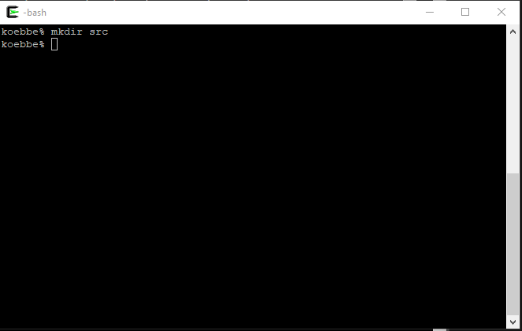
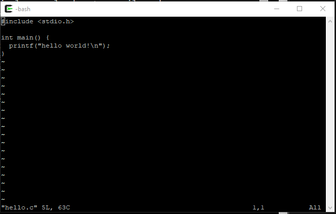
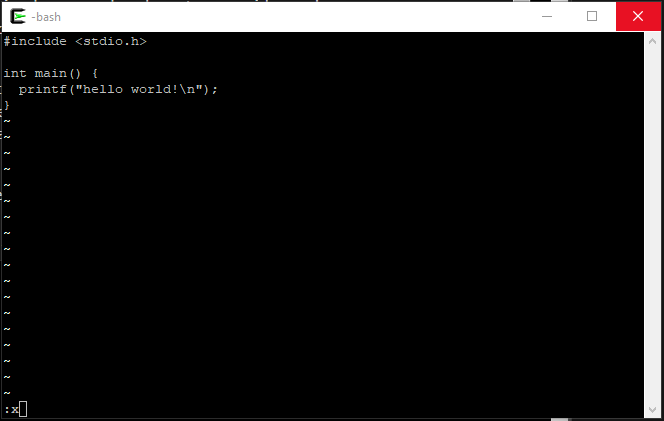
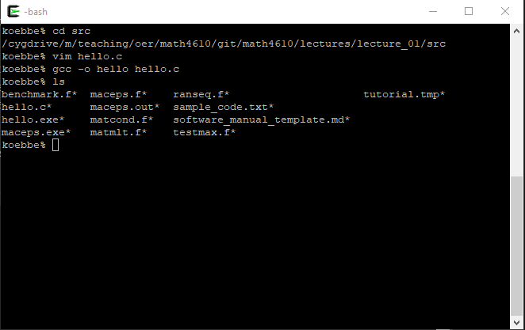
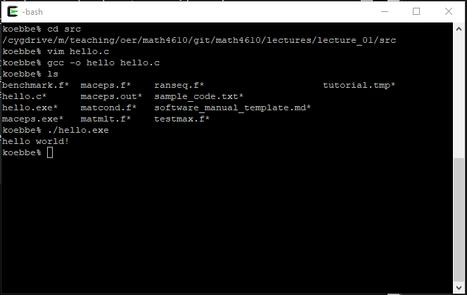

# 
 Math 4610 Lecture Notes A Brief Coding/Compilation Example 

## 
 Joe Koebbe 

  These notes are part of an
  [Open Educational Resource](https://www.oer.usu.edu/)
  project sponsored by Utah State University

**Coding Example for Math 4610 at USU: Creation of a sub-directory.** 

First start up a terminal to do the work to create a file with code in it. For
Cygwin, double click on the Cygwin Icon on your desktop or click on the the
icon in the task bar.

A terminal as shown below will appear. Type in the command shown to create a
new subfolder in the current directory. In the window, the command that does
the work is:

     mkdir src

**Coding Example for Math 4610 at USU: Change Directory and Edit**

To change the directory, use the command

     cd src

Once in the new directory, the next step is to edit a file to implement some
sort of action for the computer. So, type:

     vim hello.c

The editor, "vim" is a very standard editor and comes with the installation of
Cygwin.

**Coding Example for Math 4610 at USU: Typing in a Program in C** 

The lines in the terminal shown below define a C program for doing a very simple
task. Namely, to print the string

    hello world!

to the screen.

**Coding Example for Math 4610 at USU: Getting Back to the Command Prompt**

 
To exit the vim session and save the file, type in a colon character ":"
followed by x and return. The terminal will revert to a command terminal ready
to type in commands.

**Coding Example for Math 4610 at USU: Compiling the Code** 

At the command prompt, the first two lines will be as they were to start. The
next line is used to compile the code. That is,

     gcc -o hello hello.c

will compile the program and create an executable file for you. The last part
below is used to see what is in the directory. The executable file is

     hello.exe

**Coding Example for Math 4610 at USU: Final Step - Run the Code** 

Once we have an executable file, hello.exe, the code can be run as follows.

     ./hello.exe

The output from this command will be as shown in the image below. The output is
printed on the first line.

