# 
 Homework Repository Structure and Permissions 

## 
 Joe Koebbe 

**How to Build the Homework Repository**

  These notes are part of an
  [Open Educational Resource](https://www.oer.usu.edu)
  project sponsored by Utah State University

The first task students will need to address is how to organize homework
solutions that are completed. The homework will come in the form of task sheets
and upon completion of tasks, students will need to turn in their work. Students
will be required to create a table of contents for the homework solutions and a
structure that organizes the different solution sets. The steps that students
will need to perform are the following.

  * Create a table of contents file called hw_toc.md. The form and contents of
    the file will be described in this lecture. Students will need to account
    for a couple of entries during the course.

  * Modify the name of the file to create a folder/directory to store solutions
    for the tasks completed.

  * In addition, a subfolder for each task sheet must be included.

Note that Github will not allow you the luxury of creating empty folders. This
is an advantage in using "git" on a local machine. When changes are "pushed" to
Github, empty folders are ignored. So, let's get started on the formatting the
homework solutions portion of the repository for the class.

**Homework Repository for Math 4610:** Get to Github. 

The first step is to login to your Github account. So, in a web browser, type in

     https://github.com/

and log on to your account. By this point you should already have an account on
Github.

**Homework Repository for Math 4610: Login to Your Account.** 

Use the popup to login to Github with your user name and password.

**Homework Repository for Math 4610: Starting Point for Working on a Repository.** 

Once the following pops up, we can navigate through the repositories if you
have more than one. In any case, you should have a repository named

     math4610

Click on this repository to start creating files and the like. Once the
repository is created, students can click on the name to work on the repository
or use files in the repository.

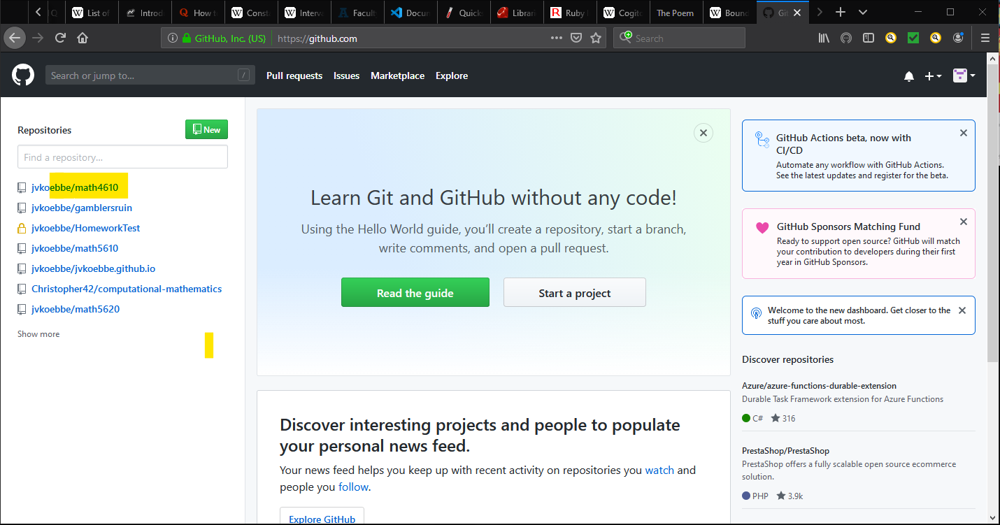

**Homework Repository for Math 4610: Creating a File.** 

To start putting together the repository for submitting task solutions, students
can create a new file by clicking on the button as shown below. In particular,
students should create the table of contents file for the task sheets. The goal
is to get to the repository and create the table of contents for the solutions
to the tasks that will be completed.

**Homework Repository for Math 4610: Type In Lines to Create the Table of Contents.**

In the following figure, two things should be noted. The first is the name of
the file

     hw_toc.md

Note that the extension, ".md" indicates to a browser that this is a MarkDown
file. We will spend more time on using MarkDown in this and other lectures in
the course. The second piece of the puzzle is the circled region where you can
type in lines that will be used in the file. All you need to do is click to the
right of the numbered line and start typing.

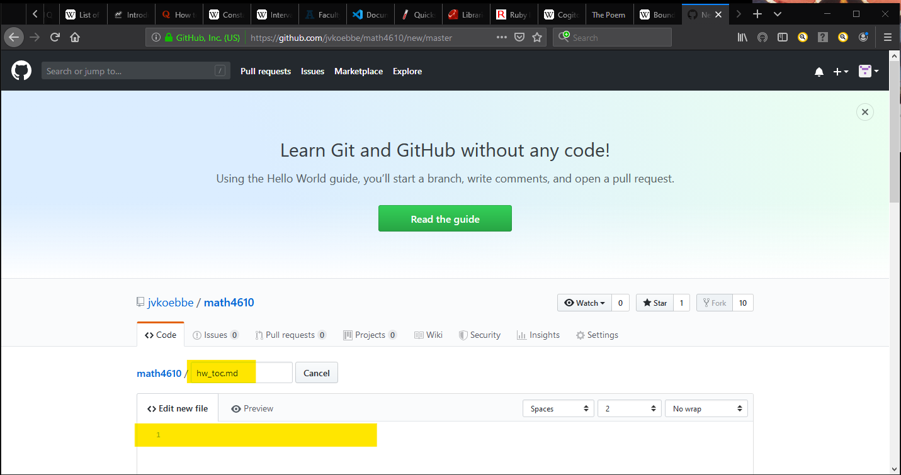

**Homework Repository for Math 4610: A Start to a Table of Contents.** 

To give an idea of how to use MarkDown to set up a table of contents. Each of
the lines serve a function in the table of contents.
\begin{verbatim}

     # Math 4610 Homework Solutions

This line is a header line due to the pound sign. The second nonblank line is a
header line with a smaller font size. Note that these lines are short hand in
HTML for <h1> and <h2>. The next two lines provide links to other files that
will contain your homework solutions. Note that the asterisk preceding the text
in these lines indicates a bullet should be placed in front of the text. There
are tasks in the homework that will walk you through at least some subset of
MarkDown syntax. Note that one of the tasks requires students work through a
tutorial on Markdown syntax.

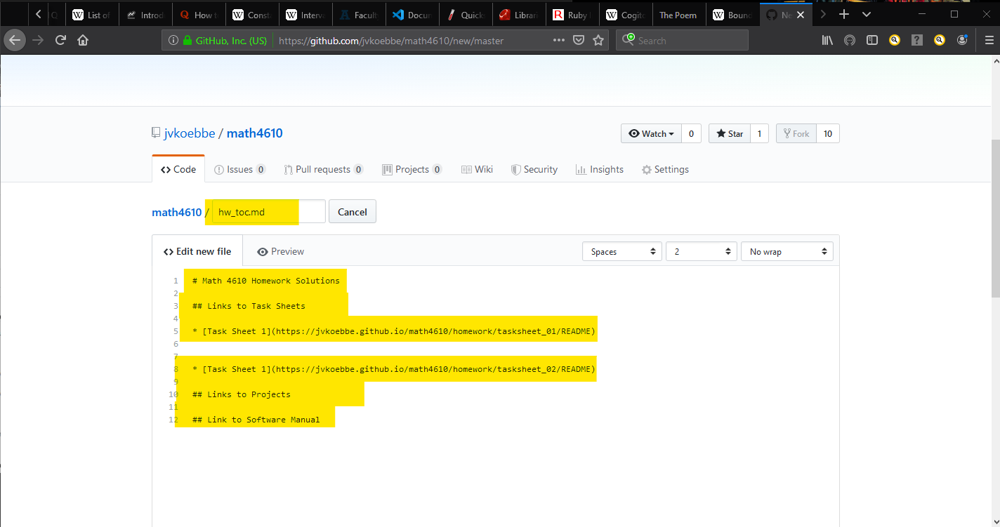

**Homework Repository for Math 4610: Adding and Committing the File.** 

Version Control Systems (VCS) like git do not make changes to a repository 
unless a commit has been made. If you scroll down to the bottom of the webpage
there are a couple of boxes and buttons to consider. The textboxes allow the
user to enter comments about the changes being made to the repository. It is
strongly recommended that students add comments about the changes being made.
Finally, the is a button that will seal the deal on the modifications. To
push the changes, click on the

     Commit new file

button. If you do not want to keep the changes, click on the

     Cancel

If you cancel the changes, a popup will appear that will allow you to reconsider
the choice. So, click on the Commit button.

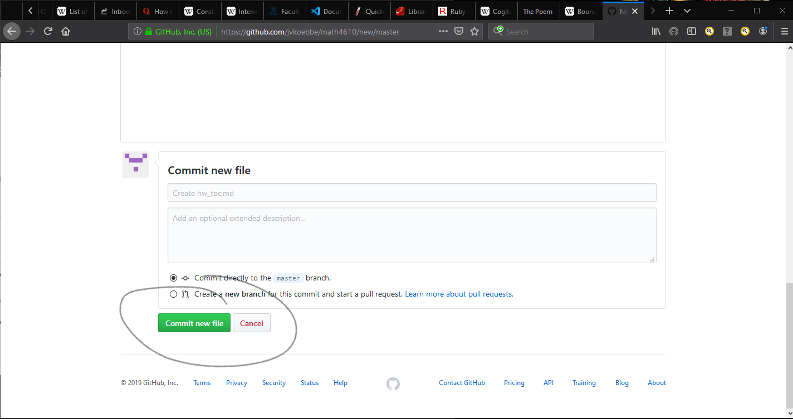

**Homework Repository for Math 4610: Another Example of File Creation.** 

There are a couple of ways to create folders in a repository. One way is to go
back into the editor function on Github and modify the name of an existing file.
For this part of the lecture, a different repository will be used since the
instructor already has a repository named "math4610". Students should
use their math4610 repository to follow along with this example. To start the
process, create a file

     harmless.md

You can include some text as shown and then commit the change as shown above.

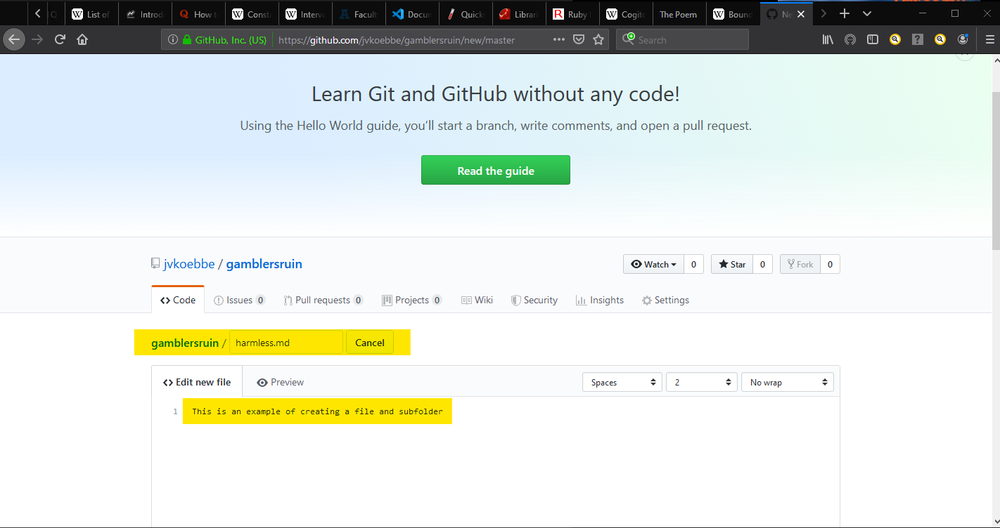

**Homework Repository for Math 4610: Find the Filename in the Repository.** 

Next, click on the repository name at the top of the webpage. Students should
see the file name

     harmless.md

in the list of files. Click on the filename in the list to show the contents of
the file. 

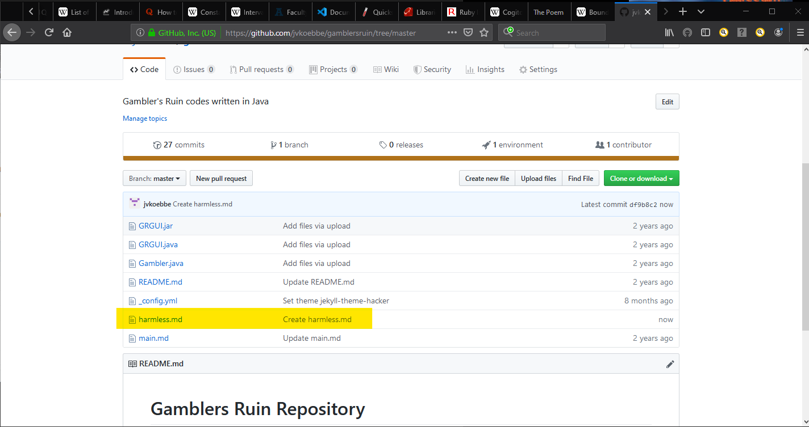

**Homework Repository for Math 4610: Rename the File while Creating a Subdirectory.**

Click on the file

     harmless.md

to open up the contents of the file for editing. To modify the file name, click
on the little pencil to start editing the file. This will show the file name in
a box and allow changes to be made in the file.

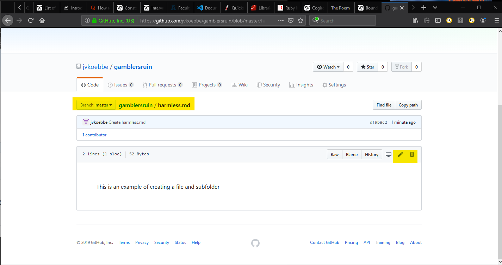

**Homework Repository for Math 4610: Rename the File and Create a Subdirectory.**

The last step is to click at the beginning of the file name. The box that the
file name appears in is editable. So, you can change the name or include the
file separator that is used to create a new folder. Note that since there is
a folder in the file name, Github will be glad to create the folder for you.
In this example, the subdirectory

     temp

is created as an example. You can name the folder anything you like.

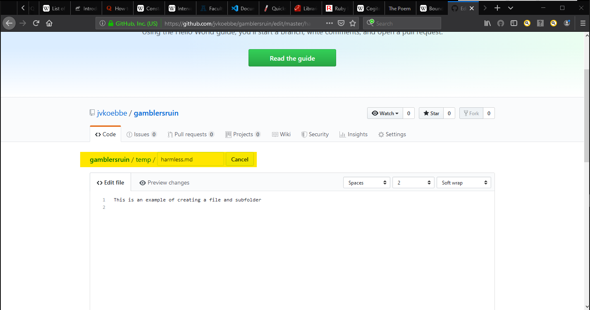

**Homework Repository for Math 4610: Commit The New File and Folder.** 

You must commit the changes using the

     Commit changes

button near the bottom of the page.

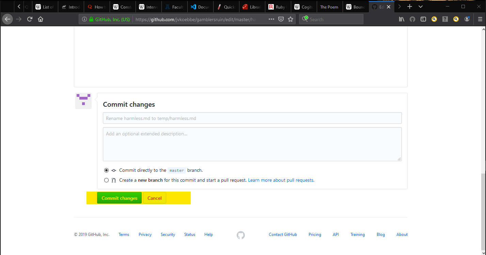

**Homework Repository for Math 4610: Finding the new File and Folder in the Repository.** 

The folder name will appear in the list of files and folders for the repository.
Note that folders are listed first. Clicking on the folder

     temp

will open the folder and show the file created. Recall that Github does not
like or allow empty folders. So, there must be something in each and every
folder.

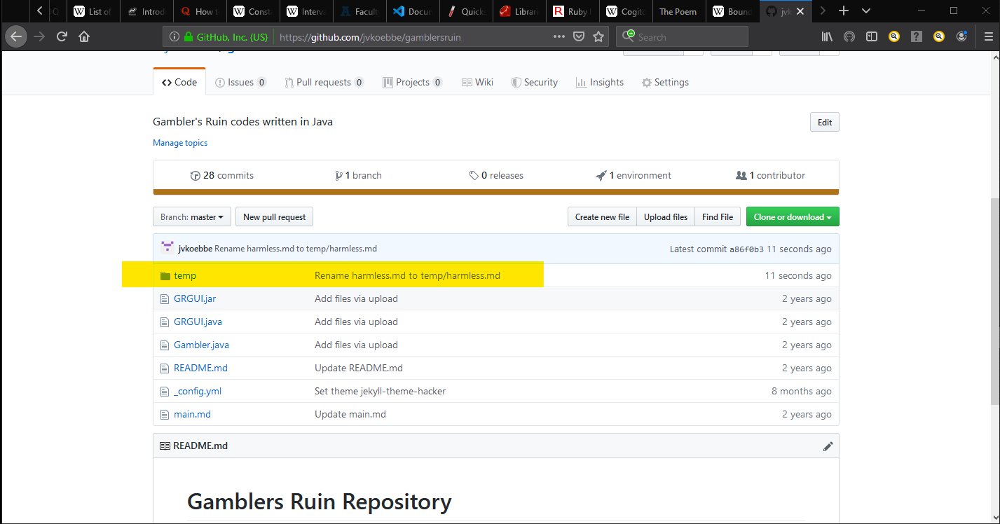

**Homework Repository for Math 4610: Deleting Folders Repository.**

To start the process, click on the folder you want to get rid of and click on
the folder name. This will show the content of the folder.

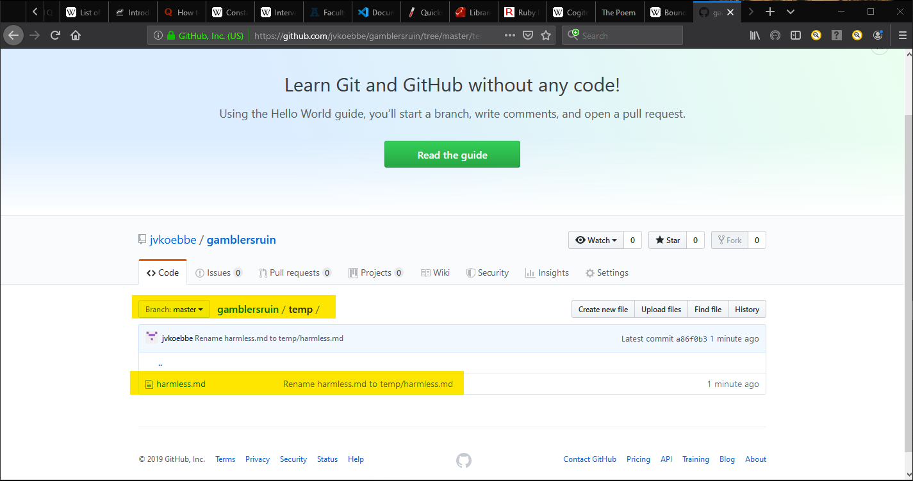

**Homework Repository for Math 4610: Deleting the Files in the Folder Repository.**

Delete the files one by one, by clicking on each file and then choose the
garbage can to delete each of the files. Note that there will be one more step
when all the files have been deleted. That is the Commit change button must be
clicked to make all changes final.

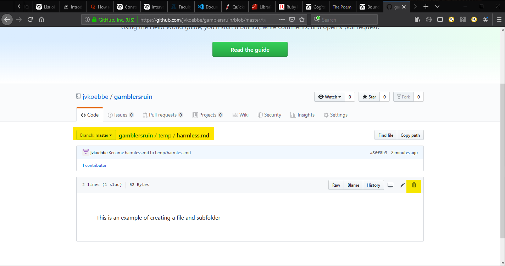

**Homework Repository for Math 4610: Commit the Changes.**

When you are done deleting the files, click the Commit change button. Note that
when all the files have been dumped in the trash, since there is nothing left in
the folder, Github automatically dumps the folder in the trash. In the example,
here when the file 

     harmless.md

is deleted, students should see the folder contents for the parent directory
show up. The folder

     temp

will not appear. This will be shown below.

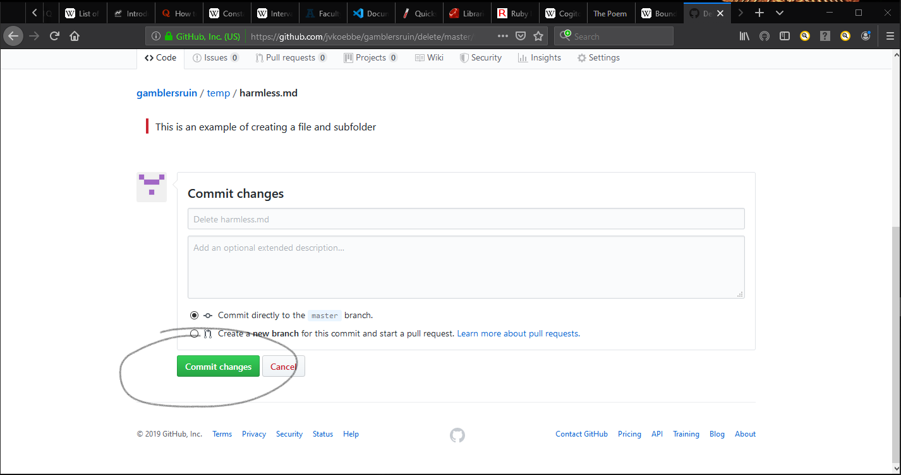

**Homework Repository for Math 4610: Check to See if the File is Deleted.** 

The last step is to see if the file has been deleted in the Github repository.
Click on the repository while logged in and look for the

     temp

folder. Note that by deleting the file

     harmless

Github will throw away the folder and it will gone.

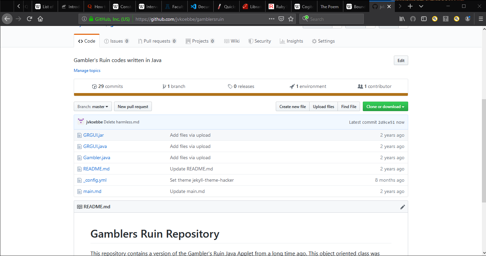

[Top of Lecture](https://jvkoebbe.github.io/math4610/lectures/lecture_02/md/lecture_02)

