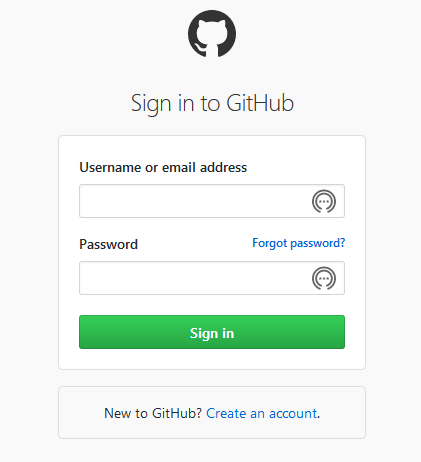

# Math 4610 Fundamentals of Computational Mathematics  - Topic 3. 

We will be using git and Github to do almost all of our work. This includes
setting up a place store and retrieve files, save code, assignments, and your
software manual. You will need to set up an account on Github if you have not
done so. If is relatively painless and is free to students. You can do most of
your work on Gihub although it will likely be a lot more convenient to work
locally. We will talk more about the command line platform, git, sometime
during the second lecture.

There are three concepts that are embedded in the first paragraph. These are
(1) Github, (2) git, and (3) some sort of software manual. To ensure we see
the distinction, a brief explanation of the relationships might help. Github
is a site/platform located somewhere out on the intenet. You can interact with
Github by visiting the web site

    https://github.com

You will need to visit the site to create an account for yourself if you do not
already have such an account. The command language, git, allows you to interact
with Github without a browser. You will need internet access along with a local
terminal interface (oops, another undefined concept). You can move entire file
structures to Github using a push/pull to do the work. Finally, the software
manual you will create will be stored on Github and also on your local machine.

The main thing to achieve in this topic is to have all students create an 
account on Github begore the next lecture. Once you have an account, we can
start building repositories for class and other fun projects you might have. So,
let's see how to create a Github account.

## Github Primer for Math 4610 at USU: Get an Account

To create an account on GitHub, open up your favorite browser and go to the
Github main site:

    https://github.com

The following shows what will pop up when you use a browser to get to the site.
You will need to set up a free student account for use in the course. In
addition, it is important that you choose a user name that will be easy to
recall. Note the use of a secure connection using https.

## Github Primer for Math 4610 at USU: Get an Account 

To create an account on GitHub, go to the Github site

    https://github.com

This site will display a place to create an account or sign in to an existing
account.

## GitHub Primer for Math 4610 at USU: Setting up a Repository 

Once you log in, you will need to build a repository for use in the class and
to turn in homework and completed tasks and projects. For the course, you must
create a repository named the following:

    math4610

Use only the characters above and using the following rules:

1. Use only lower case characters - github is case senesitive.
2. Do not put any blanks in the name of the repository.

Note that the instructor will use only this repository name in looking for your
work.

## Github Primer for Math 4610 at USU: List the Contents of the Home Directory

If you have an account on GitHub, you will already know a lot about these
things. However, when you are logged in you will see the main screen with any
repositories you may already have created. We will go through the steps to
build and name repositories in the next few pages.

[Previous](../../topic_02/pdf/embed_02.md)
| [Table of Contents](../../toc/md/topic_toc.md)
| [Next](../../topic_04/md/topic_04.md)

