

# Math 4610 Fundamentals of Computational Mathematics  - Topic 7.

We will need to communicate through Github for most of the semester. Github is
a site where you can store/share all kinds of computational data, programs, and
documents. So, in this topic we will go through the process of setting up an
account, if you do not already have an account, and set up a repository for the
course. Once this is done, we will work with folders and subfolders where you
will be able to complete homework and other assignments. More importantly, 
learning how to create a repository is important.

## Get an Account on Github 

To create an account on GitHub, go to the Github site on any browser. If you
already have an account, you can skip this step.

    https://github.com

This site will display a place to create an account or sign in to an existing
account. If you have an account, sign in. If not, work through creating an
account. Accounts for students are free on Github. For instructors and faculty
the fee is more than reasonable.

## Signing into Github If You have an Account

If you already have an account or have created an account and logged off you
will need to be signed in. A screenshot of the Sign In page is shown below.

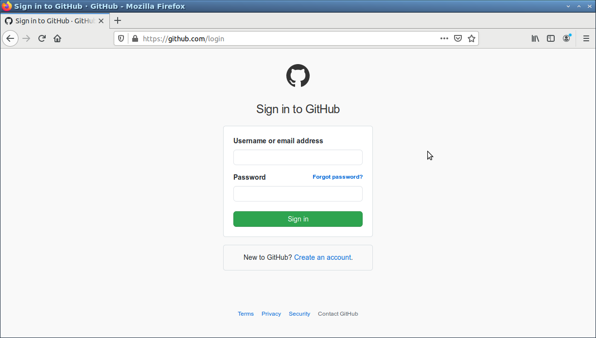

The following figure shows the fields filled in to get access to your Github
account.

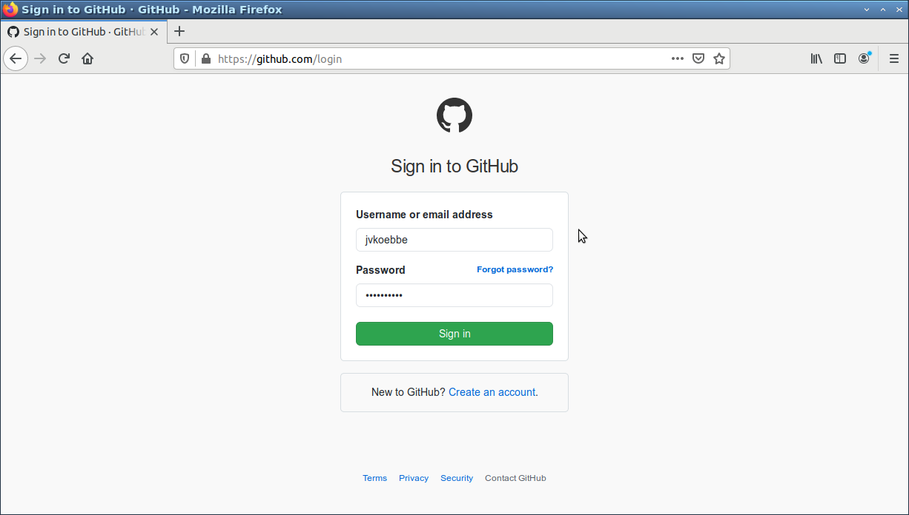

## Navigating the Github Home Page 

Once you log in, you will see a home page that looks like that in the figure
below. In the example, the instructor's page has a bunch of repositories for
various reasons. There is already a repository for this course, Math 4610. The
notes, assignments, and other information is all stored and shared from this
repository. The name of the repository is, math4610. Note that on the homepage
for the site, there is a link, jvkoebbe/math4610. If you click on the link the
browser will display the main page for the course. Note that you can move around
the site by clicking on links or through menu terms in the tool bar at the top.

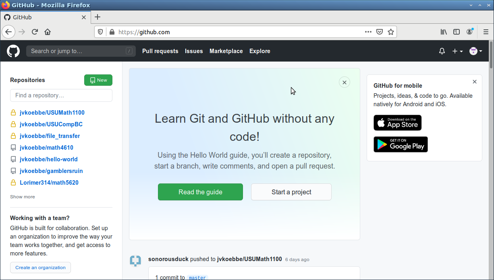

## Creating Your Own Repository for the Class

With the home page up and running on your Github page, you will need to create
a repository to work on homework and other assignments. There is a hard and fast
rule that you will need to observe on the repository. To minimize the amount of
work in grading, you must name your repository the following:

    math4610

Use only the 8 characters above and obey the following rules:
\begin{enumerate}
  \item Use only lower case characters - github is case sensitive.
  \item Do not put any blanks or other characters in the name of the repository.
\end{enumerate}
Note that the instructor will use only this repository name in looking for your
homework and other assignments. 

## How to Create a Repository

To build a repository, click on the + button in the upper right hand corner of
the window and click on the New Repository item at the top of the drop down
menu.

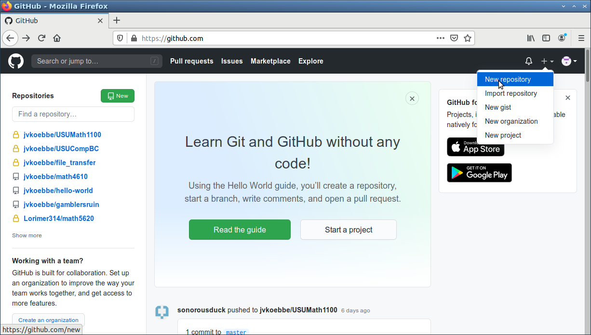

## Start Page for a Generic New Repository. 

After clicking on the New Repository item the following generic start page for
the repository will appear. You should also see your user name under the Owner
text box. The second figure below shows the same page with appropriate
information. The information includes the name of the repository (temp\_repo)
for this example, a brief description, the Private radio button filled in, and
finally a check put in to create a README file to start.

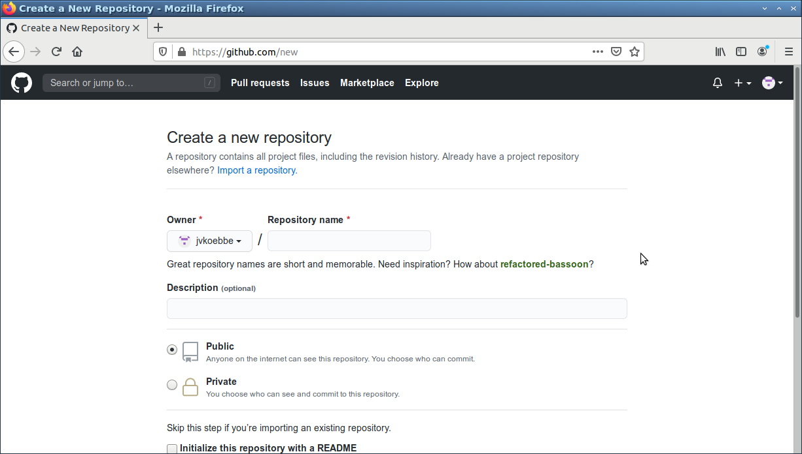

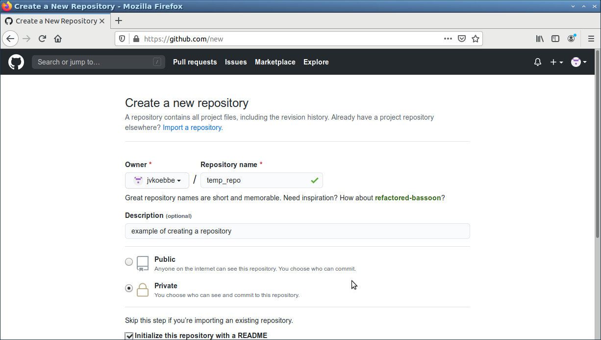

The Last Step in Building a Repository. 

The final thing to do in the creation of a repository is to click on the green
commit button at the bottom of the page. There are a couple of notes to keep in
mind in creating the repository. First, the repository in the example is not
named math4610 - as yours should be. Since there is already a repository with
that name, a different name has been chosen. Once the Create repository button
has been clicked the repository is now available.

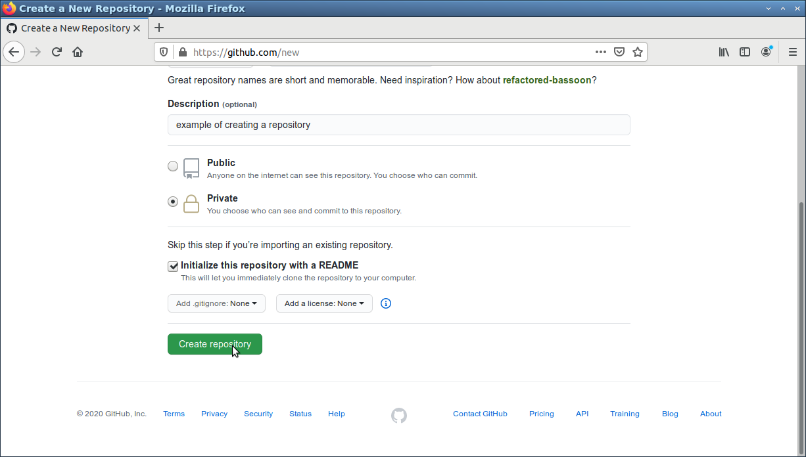

## Deleting a Repository.

It is relatively difficult to delete/remove a repository. You have to actually
answer some questions before this is done. The temporary repository that was
created in this topic will now be deleted. If you have created a repository with
the correct name, math4610, you do not need to do this step. If you used a
different name, you may want to follow along. First, navigate to the location of
the offensive repository, temp\_repo. You should see the page shown in the first
figure below. Then click on the Settings tool in the tool bar for the repository
see the second figure below.

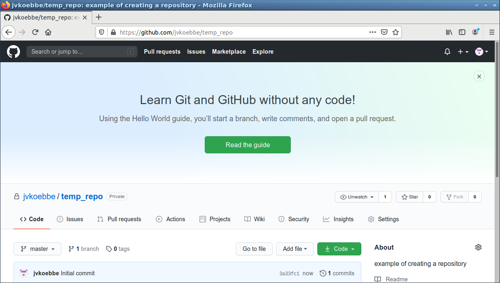

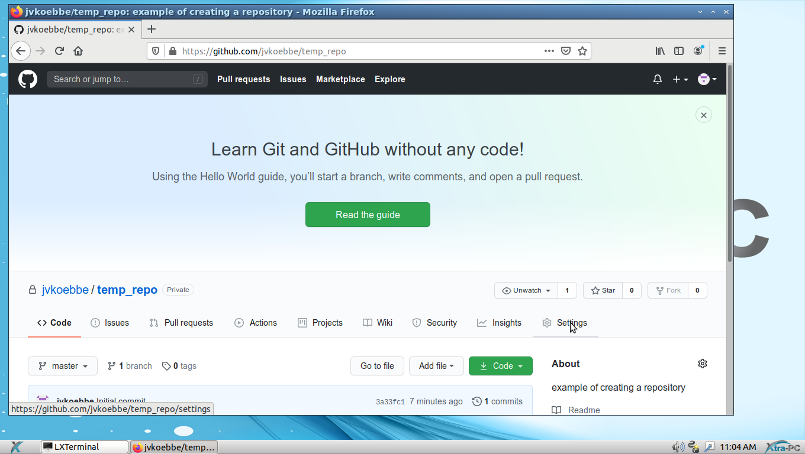

Deleting the repository.

The Settings page will pop up as shown in the first figure below. Scroll to the
bottom of the Settings page. When you click on the delete button a popup window
will appear with a final check.

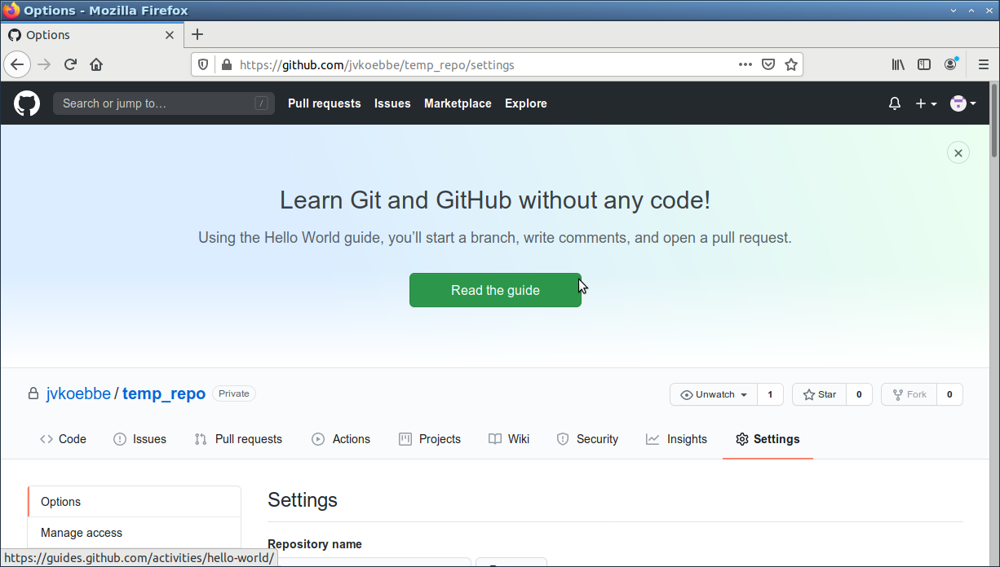

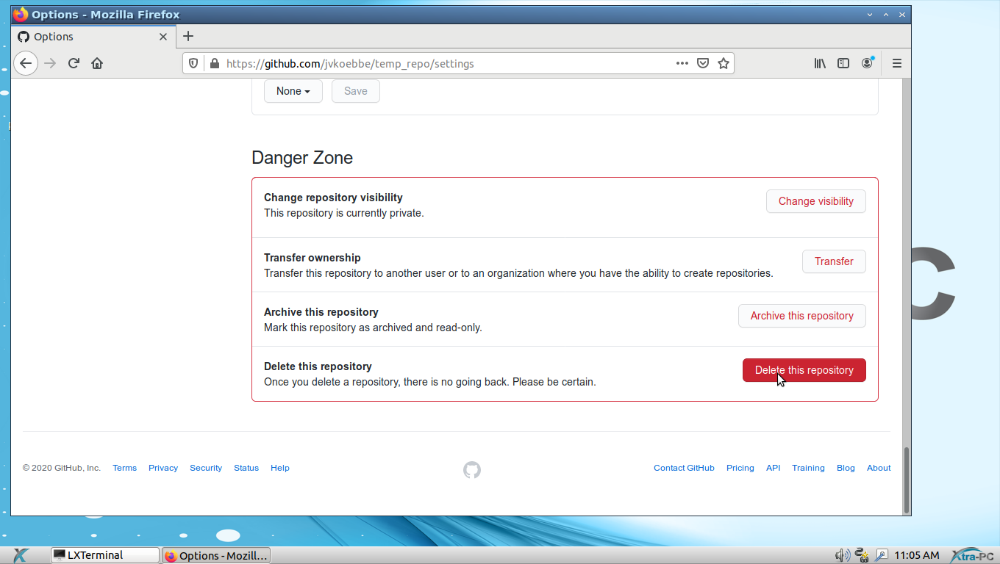

## The Final Step in Deleting a Repository.

To make the change permanent, you need to enter the name of the repository into
the text box on the popup and then click on the "I understand the
consequences..." button in order to finalize the deletion. Once this has
been completed there is absolutely no way to retrieve a repository on Github.
If you are using git to work on repositories locally on your computer, the
local version of the repository will not be deleted. We will see how to work
with git in topic for the course within the next few lectures.

[Previous](../../topic_06/md/topic_06.md)
| [Table of Contents](../../toc/pdf/embed_toc.md)
| [Next](../../topic_08/md/topic_08.md)

