

# Math 4610 Fundamentals of Computational Mathematics  - Topic 8.

## Using git to Work Locally on Your Computer 

You can chose to work on projects on Github by logging onto the Github web site
with your username and password. However, if your internet connection is not as
good as you might like, you can use "git" to synchronize the work
on your project. The git environment is a Version Control System (VCS) which
allows different groups to work on the same project without stepping on each
other's toes. In addition, the software keeps track of versions of the software
that you can revert to if something goes wrong. In this topic we will learn a
bit about git and start using git to synchronize your work on Github. Your work
will be downloaded from Github for grading. So, you will need to learn how to
push and pull versions of your work as it changes.

## Using git to Work Locally on Your Computer

The first thing to do is to make sure that git is available within your terminal
or terminal emulator. After opening a terminal, use the following command:

    koebbe% which git

If git is available, you will see output like that in the following figure. In
this case, the executable for git is in the folder named, /usr/bin.

If git is not available, you can install the software on most computers. If you
need some help getting the software installed, talk to your instructor.

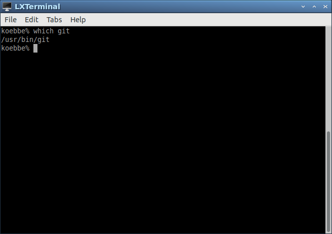

## Commands in the git VCS 

This section of notes will not cover all possible ways to use and modify git.
Instead, we will look at some basic commands that git uses to share the data in
a repository. The general form for a command using git is the following:

    % git command [options]

To start, we can type in the command

    koebbe% git --help

This produces a couple of screens of output. Another way to display the same
output, one screen at a time, is to pipe the output from the command above into
another Unix command, more. The result is

    koebbe% git --help | more

The concept of pipes in Unix is to take the output from one command and use
this as input to another command. So, the output from

    koebbe% git --help

is piped into the more command. The more command will display output one screen
at a time. You should try this on any file in your folder some time to see how
is works. Something like

    koebbe% more myfile.txt

will display the contents of the file named, myfile.txt. If you do this on a
binary file, the output will not be readable.

What you should notice is all of the options for running commands within git.
The end result is that you can read the first screen and then hit a space bar
to read the next screen. The rest of this section of notes will go over a bare
minimum of git so that you can work on your own computer at home.

![The first part of the output gives about half of the possible options we can use with git.](../images/git_02.png}

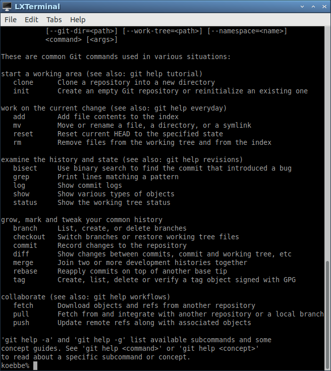

## Initializing a Folder Using the git init 

The git command platform is used to create folders that mirror repositories like
those created on Github. To start, there are two ways to initialize a git
folder. The first is to create a new folder and initialize the folder using the
following three commands.

    koebbe% mkdir tempdir
    koebbe% cd tempdir
    koebbe% git init

The first command makes a directory which will be initialized to a git folder.
The next command changes the working directory to be the new directory, and the
last does the initialization. As the output shows, the result is an empty git
repository. The other method will work well when making a copy of a Github
repository that already exists. You can clone a repository from another site,
like Github. To do this, change into the folder where the repository folder will
end up.

## Initializing a Folder Using the git clone 

We can use the clone command in git to make a copy of a repository on Github.
To do this, start by changing folders to the location where you want a copy of
the repository to be cloned. This can be done as follows.

    koebbe% cd foldername
    koebbe% git clone https://www.github.com/username/repositoryname

for an existing folder. So, if Fred has chosen fred as a username and the
repository, math4610, on Github, the pair of commands would be

    koebbe% cd repository_location
    koebbe% git clone https://www.github.com/fred/math4610

This will put a copy of everything in math4610 in a directory on your computer
along with a subfolder named .git. Note that in the figure below a different
repository was used. The math4610 repository for the course is too large and
takes a bit of time to clone.

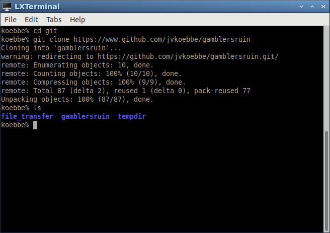

## Using the git status Command 

One of the most used commands in git is the status command. This will tell you
about any changes that have been made by you between sessions. For example,

    koebbe% git status

will produce a list of files and folders to which changes have been made. Note
that the git commands can be run from the main folder or any subfolder within
the git folder tree structure. You will use this command over and over if you
are being efficient. An example of the output is shown in the next figure when
working in repository. Note that the git status command is embedded in the work
shown in the figure below.

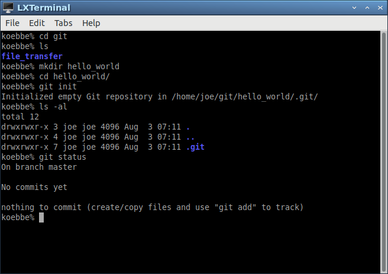

## The git commit Command 

Once the status command has been invoked, we will want to commit the changes so
that they can be copied back to our main working project. If files have been
added or removed, the output from the status command will produce a message to
that effect. So, we will need to add/remove the files to this branch of the
repository. The following figure shows this. Note that the last command will 
commit the changes. We will see the results of the commit command below.

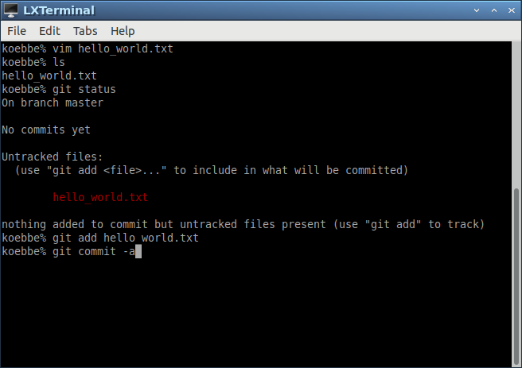

## The git push Command 

In the last figure, the git commit command has been typed in to complete the
changes identified by the git status command. The command is

    koebbe% git commit -a

The output from the command will be inside an editor. You will need to enter a
comment to document the changes that have been made. If no comment is added the
commit command will be aborted. All you need is to add a single line (or just
one character) to the file that pops up for the commit to take place.

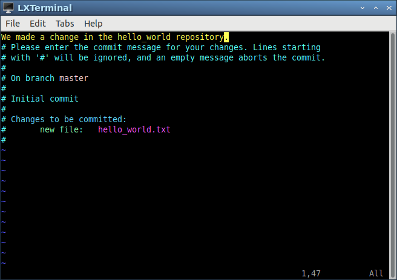

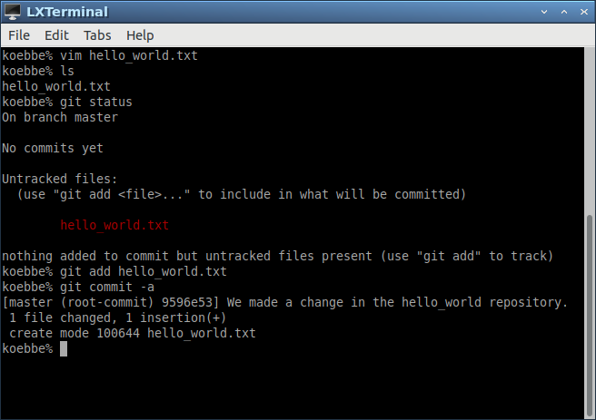

## Running the Git Status Command Again 

Using the git status again will show that everything is up to date. So, the
message we see indicates the Master Branch has nothing to commit. We can see
this in the next figure.

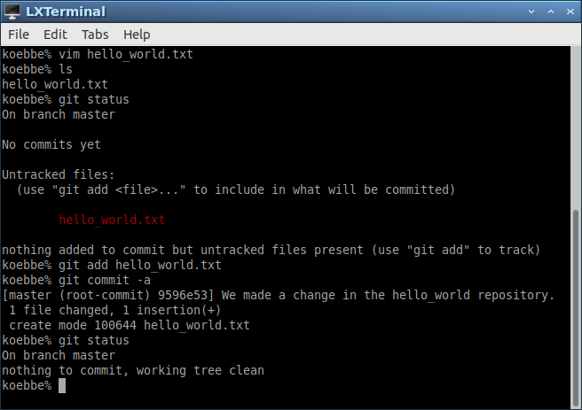

## Using The README File As A Starting Point 

When you access your repository from the outside world, a browser will actually
find the README Markdown (.md) file. So, when a repository is created, it is a good idea
to create and modify this file with a basic description for the repository. An
example is given in the next two figures that show how to change into the main
folder for a repository on your computer and then edit the README file.

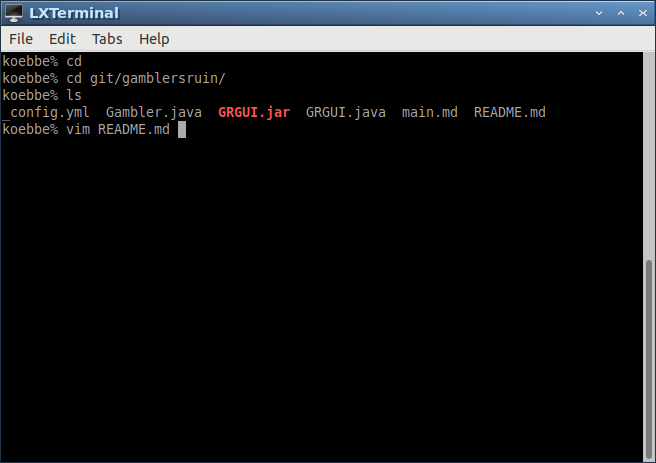

## Modification of the README file 

In the next sections of this topic, we will see how to include the modifications
on a repository on Github. The next two figures show how to check the status of
the repository, include modifications to the repository, and then push those
back to the main repository on Github.

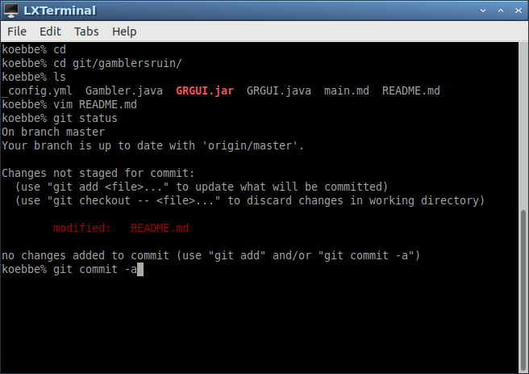

## Using Git Push to Merge Changes

The next step is to merge any changes locally with the repository on Github.
The command central to doing this is is

    koebbe% git push

You will need to enter your Github user id and password to be able to complete
the command. The next figures use the following git commands to do the work.

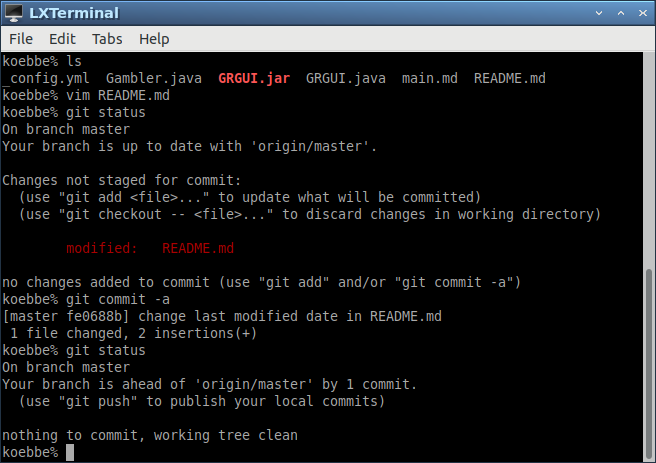

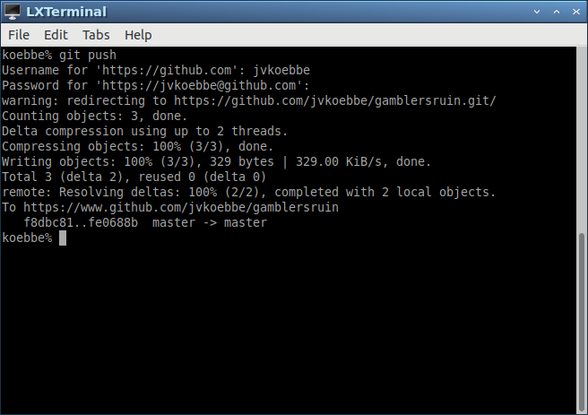

## ...And One Last Check of Status

Finally, we check the status of the repository which shows everything is clean.

## The git pull command

If you or anyone else has made changes to a repository on Github. You can pull
those changes to your local copy using the following git command.

    koebbe% git pull

The clone command starts a new copy of the repository from Github on your local
machine. The pull command only makes changes to a local repository using those
on a site like Github. You will need to type in your user id and password like
in the git push command. You should try these types of commands and use the git
push command regularly.

[Previous](../../topic_07/md/topic_07.md)
| [Table of Contents](../../toc/md/topic_toc.md)
| [Next](../../topic_09/html/topic_09.html)

